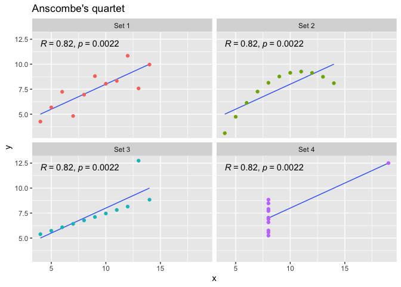
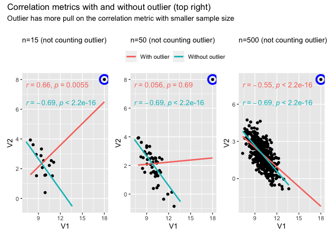
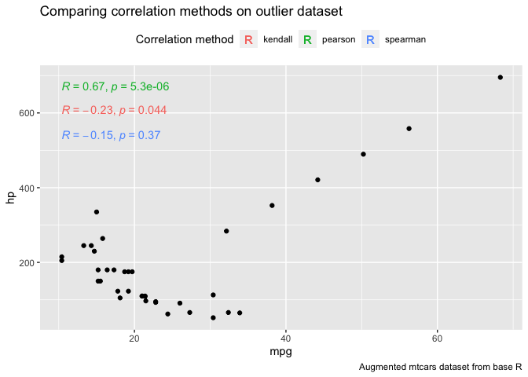

Correlation: 3 Practical Best Practice Reminders
================

### Notebook objective

  - Explore common correlation methods to build use case intuition
  - Surface best practice reminders when using common correlation
    methods

### Packages

``` r
required_packages <- c('tidyverse', 'patchwork', 'MASS', 'ggpubr', 'correlation')

for(p in required_packages) {
  library(p,character.only = TRUE)
}
```

# 3 Practical Best Practice Reminders

### 1\. Plot bivariate correlations alongside correlation metrics

  - [Pearson correlation coefficient
    (r)](https://en.wikipedia.org/wiki/Pearson_correlation_coefficient)
    tends to be the default correlation method across statistical
    software
  - Pearson correlation coefficient most applicable for measuring linear
    association between variables
  - Pearson r can be misleading for datasets that have non linear
    associations and/or outliers
  - [Anscombe’s
    quartet](https://en.wikipedia.org/wiki/Anscombe%27s_quartet) is a
    famous example of 4 datasets with similar summary statistics and
    equal correlation values with drastically different distributions
  - Correlation metric most applicable for set 1

<!-- end list -->

``` r
### tidy version method included in pivot_longer documentation
### https://tidyr.tidyverse.org/reference/pivot_longer.html
tidy_anscombe <- anscombe %>%
  pivot_longer(
    everything(),
    names_to = c(".value", "set"),
    names_pattern = "(.)(.)"
  )

tidy_anscombe %>%
  ggplot(aes(x=x,y=y)) +
  geom_smooth(method="lm", se=F, size=0.5) +
  geom_point(aes(color=set)) +
  facet_wrap(. ~ paste0("Set ", set), ncol=2) +
  stat_cor(label.y.npc="top", label.x.npc = "left") +
  theme(legend.position = "none") +
  labs(title="Anscombe's quartet")
```

<!-- -->

### 2\. Outliers more like to skew correlation metrics with smaller sample sizes

  - Watch out for outliers when deriving correlations (especially with
    small sample sizes)
  - See below for correlation methods more robust to outliers vs default
    Pearson method

<!-- end list -->

``` r
### Inspiration source for generating correlation data
### r-bloggers.com/2021/05/how-to-generate-correlated-data-in-r/
set.seed(5)
# create the variance covariance matrix
sigma<-rbind(c(1,-0.7), c(-0.7,1))
# create the mean vector
mu <- c(10, 2) 
# generate the multivariate normal distribution
df <- as.data.frame(mvrnorm(n=500, mu=mu, Sigma=sigma))

set.seed(10)
p0 <- df %>%
  sample_n(15) %>%
  rbind(tibble(V1 = 18, V2 = 8)) %>% 
  ggplot(aes(x=V1,
             y=V2)) +
  geom_point() + 
  geom_point(data = tibble(V1 = 18, V2 = 8), 
     size = 5, shape = "circle open", 
     color = "blue", stroke = 2) +
  geom_smooth(method="lm", se=F, aes(color="With outlier")) +
  geom_smooth(data=df, method="lm", se=F, aes(color="Without outlier")) +
  stat_cor(aes(color="With outlier"), 
           cor.coef.name ="r",
           show.legend = F) +
  stat_cor(data=df, 
           aes(color="Without outlier"),
           cor.coef.name ="r", vjust=4,
           show.legend = F) +
    labs(color="",
         subtitle="n=15 (not counting outlier)")

set.seed(10)
p1 <- df %>%
  sample_n(50) %>%
  rbind(tibble(V1 = 18, V2 = 8)) %>% 
  ggplot(aes(x=V1,
             y=V2)) +
  geom_point() + 
  geom_point(data = tibble(V1 = 18, V2 = 8), 
       size = 5, shape = "circle open", 
       color = "blue", stroke = 2) +
  geom_smooth(method="lm", se=F, aes(color="With outlier")) +
  geom_smooth(data=df, method="lm", se=F, aes(color="Without outlier")) +
  stat_cor(aes(color="With outlier"), 
           cor.coef.name ="r",
           show.legend = F) +
  stat_cor(data=df, 
           aes(color="Without outlier"),
           cor.coef.name ="r", vjust=4,
           show.legend = F) +
    labs(color="",
         subtitle="n=50 (not counting outlier)")

p2 <- df %>%
  rbind(tibble(V1 = 18, V2 = 8)) %>% 
  ggplot(aes(x=V1,
             y=V2)) +
  geom_point() + 
  geom_point(data = tibble(V1 = 18, V2 = 8), 
         size = 5, shape = "circle open", 
         color = "blue", stroke = 2) +
  geom_smooth(method="lm", se=F, aes(color="With outlier")) +
  geom_smooth(data=df, method="lm", se=F, aes(color="Without outlier")) +
  stat_cor(aes(color="With outlier"), 
           cor.coef.name ="r",
           show.legend = F) +
  stat_cor(data=df, 
           aes(color="Without outlier"), 
           cor.coef.name ="r", vjust=4,
           show.legend = F) +
    labs(color="",
         subtitle="n=500 (not counting outlier)")

p0 + p1 + p2 + 
  plot_layout(guides = 'collect') & 
  theme(legend.position = 'top') &
  plot_annotation(
    title = "Correlation metrics with and without outlier (top right)",
    subtitle = "Outlier has more pull on the correlation metric with smaller sample size\n"
  )
```

<!-- -->

### 3\. Rank based correlation metrics (i.e. Kendall, Spearman) less sensitive to outliers

  - Comparing common correlation methods: Pearson, Kendall, Spearman
  - Visual inspection suggests Kendall or Spearman correlation methods
    would be preferred over Pearson in below example
  - Pearson method recommended when variables represent bivariate normal
    distribution

<!-- end list -->

``` r
stats_df <- mtcars %>%
  summarise_at(c("mpg", "hp"), 
               .funs = list("avg" = mean, "sd" = sd))

outlier_df <- tibble(mult_var = c(2,3,4,5,6,8)) %>%
  mutate(mpg = stats_df$mpg_avg + mult_var*stats_df$mpg_sd,
         hp = stats_df$hp_avg + mult_var*stats_df$hp_sd) %>%
  dplyr::select(mpg, hp)

mtcars_2 <- mtcars %>%
  bind_rows(outlier_df)

mtcars_2 %>%
  ggplot(aes(x=mpg,
             y=hp)) +
  geom_point() +
  stat_cor(method = "pearson", aes(color="pearson")) +
  stat_cor(method = "kendall", aes(color="kendall"), vjust=3.6) +
  stat_cor(method = "spearman", aes(color="spearman"), vjust=6) +
  theme(legend.position = "top") +
  labs(title="Comparing correlation methods on outlier dataset",
       color="Correlation method",
       caption = "Augmented mtcars dataset from base R") +
  guides(color = guide_legend(override.aes = aes(label = "R")))
```

<!-- -->

### Other correlation methods

  - Some of the most common correlation methods are covered above
  - Additional correlation methods exists
  - [See Correlation R package: correlation
    types](https://easystats.github.io/correlation/articles/types.html)
